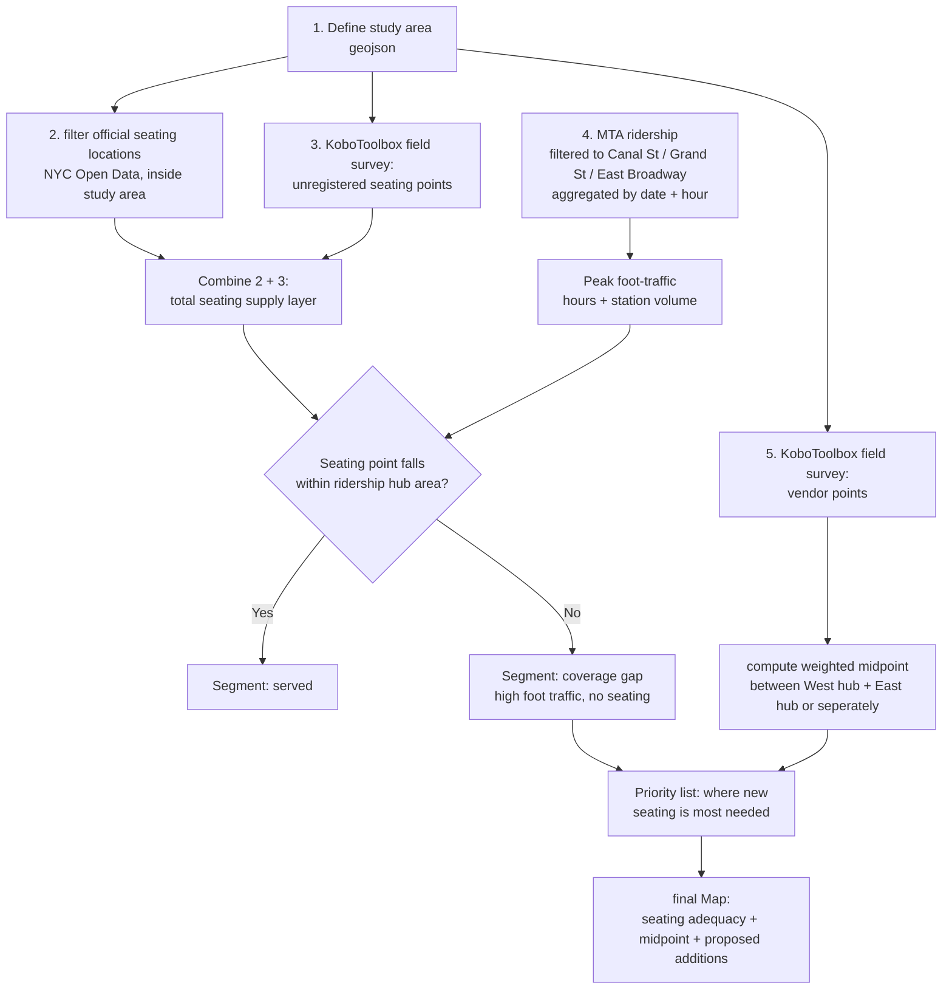

# seating as care infrastructure: chinatow case study

---

## i) narrative

Seating has always struck me as one of the most honest, unregulated pieces of urban infrastructure. Any stoop, ledge, or bench that can hold a person's weight becomes a place where people stop, talk, rest, or even conduct business. A friend once told me about a tradition near the Brooklyn Public Library: neighbors roll charis out onto the sidewalk during the day and quietly park them again at night. No one steals them. The daily rhythm of the block is built around this informal furniture.
Chinatown is where I see this vividly, every day. Street vendors line the sidewalks selling goods, standing beside their stuffs in every kind of weather, without exception. I usually resent having to weave through the crowd, but over time, the vendors themselves have become the fixed points of the street for me. One vendor, from whom I bought a bracelet, greets me with "Nihao" every time our glance share. He's always in the same spot, and he spends most of his time not standing, but sitting in a narrow plastic stool. Other vendors lean against the cars parked behind them, or perch on stoops and staircases. None of this is "seating" in the planned, municipal sense, yet it's exactly what makes the block functional for the people who work ther for 10+ hours a day.

**questions**
- where are *formal* seating locations in this stretch of Chinatown?
- are they actually accessible to vendors and pedestrians?
- where would a reasonalbe *midpoint* be for people to gather, given that vendor density skews West (predominantly African vendors) to East (predominantly Asian vendors)?
- How many *new* seating locations, if any, would be needed to meaningfully serve this corridor?

---

## ii) dataset and properties

**GeoJSON** : Chinatown area where street vendors usually located -- near the main street
**seating location** : NYC Open Data / type_Point(Lan, Lon), Asset_Subtype(*maybe seating objects' design will be needed*), Installation date
**MTA turnstile Data** : for the purpose of checking the influx of people - date, station, time, entries/exists

---

## iii) potential dataset
using Kobo box, will collect location(lon, lat) point with photos to gather an informal/undocumented seating location

---

### iv) workflow
*i used AI to format a chart in md*

---

## v) question
- is it appropriate to collect location/photo data on people(vendors) this way, even in a public-space, research context?
- MTA ridership measures people entering/existing the station, not necessarily people walking past the vendor or corridor -- would this data set is necessary?